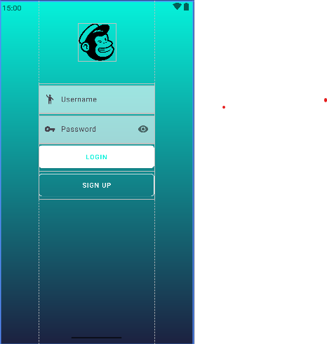
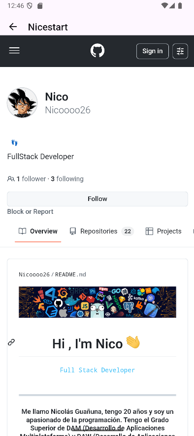
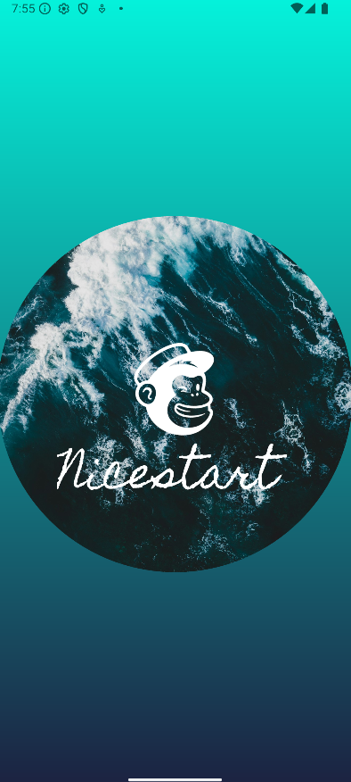
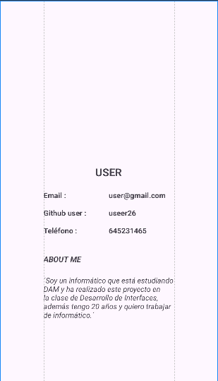

# 🌟 NiceStart
La aplicación **Nicestart** esta realizada para tener un buen impacto visual tanto en un dispositivo móvil como en una tablet.
Consta de una pantalla Splash al iniciar la aplcación que te muestra una pequeña animación.
Posteriormente entras a un Login desde el que puedes ir a registro o a la pantalla principal.
Además, existe una pantalla perfil para mostrar los datos del usuario.

## ⚙️ Detalles técnicos
- Lenguaje principal: **Java**
- IDE: **Android Studio**
- Libreria utilizada: **Material 3**

## 📱 Capturas
| 🔐 Login                         | 📝 Registro | 🏠 Pantalla Principal |
|----------------------------------|-----------|-----------|
|    |     |    |
| 🐙 GitHub                        | 🚀 Splash | 👤 Perfil |
| ----------                       |-----------|-----------|
|  |     |    |

## ✨ Animaciones
| 🎨 Splash                                   | 📁 Menu                              | 
|---------------------------------------------|--------------------------------------|
|  |  |


## 🧩 Código importante
```
    public void openSignup(View v){
        Intent intent = new Intent(Login.this, Signup.class);
        startActivity(intent);
    }
```
Este código es importante para desplazarnos entre los distintos 'Activity'.

```
    <androidx.constraintlayout.widget.Guideline
        android:id="@+id/guideline1"
        android:layout_width="wrap_content"
        android:layout_height="wrap_content"
        android:orientation="vertical"
        app:layout_constraintGuide_percent="0.2"
        />
    <androidx.constraintlayout.widget.Guideline
        android:id="@+id/guideline2"
        android:layout_width="wrap_content"
        android:layout_height="wrap_content"
        android:orientation="vertical"
        app:layout_constraintGuide_percent="0.8"
        />
```
Guideline nos permite ajustar el contenido al dispositivo añadiendo márgenes horizontales.


>Repositorio bajo licencia
>[Creativecommons Org Licenses By Sa 4](http://creativecommons.org/licenses/by-sa/4.0/)
