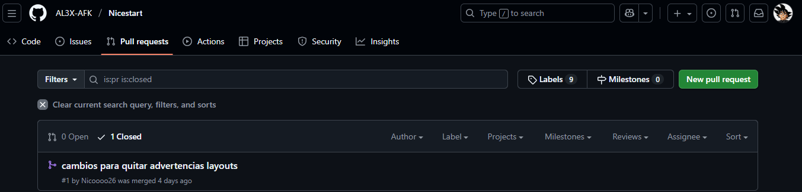
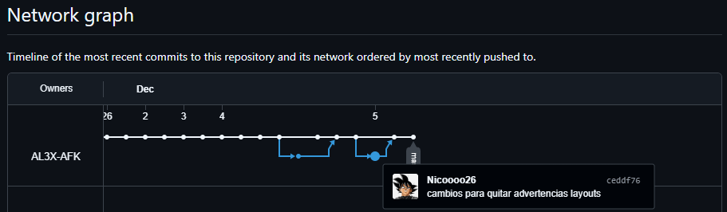
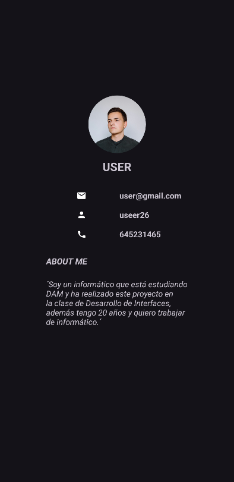
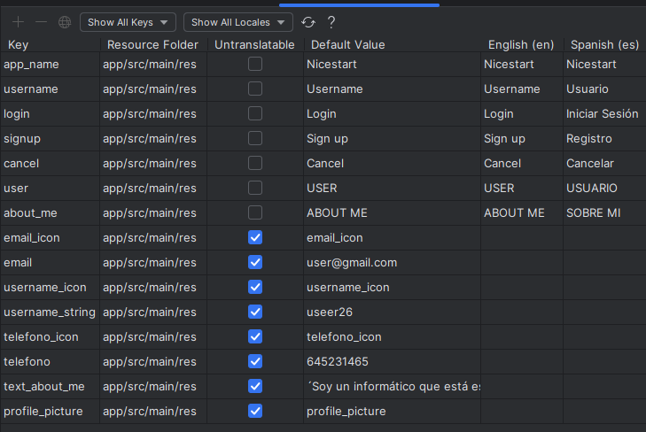

# 🌟 NiceStart
La aplicación **Nicestart** esta realizada para tener un buen impacto visual tanto en un dispositivo móvil como en una tablet.
Consta de una pantalla Splash al iniciar la aplcación que te muestra una pequeña animación.
Posteriormente entras a un Login desde el que puedes ir a registro o a la pantalla principal.
Además, existe una pantalla perfil para mostrar los datos del usuario.

## ⚙️ Detalles técnicos
- Lenguaje principal: **Java**
- IDE: **Android Studio**
- Libreria utilizada: **Material 3**

## 📱 Capturas
| 🔐 Login                         | 📝 Registro | 🏠 Pantalla Principal |
|----------------------------------|-----------|-----------|
|    |     |    |

| 🐙 GitHub                        | 🚀 Splash | 👤 Perfil |
| ----------                       |-----------|-----------|
|  |     |    |

## ✨ Animaciones Y funcionalidad Menu
| 🎨 Splash                                   | 📁 Menu                              | 
|---------------------------------------------|--------------------------------------|
|  |  |


## 🧩 Funcionalidades

### [Splash](https://github.com/Nicoooo26/Nicestart/blob/master/app/src/main/java/com/example/nicestart/Splash.java)
- [Animación](https://github.com/Nicoooo26/Nicestart/blob/master/app/src/main/java/com/example/nicestart/Splash.java#L27-L30)
- [Glide background](https://github.com/Nicoooo26/Nicestart/blob/master/app/src/main/java/com/example/nicestart/Splash.java#L32-L43)
- [Open Login before 5sec](https://github.com/Nicoooo26/Nicestart/blob/master/app/src/main/java/com/example/nicestart/Splash.java#L45-L57)

### [Login](https://github.com/Nicoooo26/Nicestart/blob/master/app/src/main/java/com/example/nicestart/Login.java)
- [Glide background](https://github.com/Nicoooo26/Nicestart/blob/master/app/src/main/java/com/example/nicestart/Login.java#L25-L35)
- [Open Main](https://github.com/Nicoooo26/Nicestart/blob/master/app/src/main/java/com/example/nicestart/Login.java#L38-L43)
- [Open SignUp](https://github.com/Nicoooo26/Nicestart/blob/master/app/src/main/java/com/example/nicestart/Login.java#L46-L49)

### [Signup](https://github.com/Nicoooo26/Nicestart/blob/master/app/src/main/java/com/example/nicestart/Signup.java)
> Se repiten las funcionalidades del Login

### [Profile](https://github.com/Nicoooo26/Nicestart/blob/master/app/src/main/java/com/example/nicestart/Profile.java)
- [Glide Profile Picture](https://github.com/Nicoooo26/Nicestart/blob/master/app/src/main/java/com/example/nicestart/Profile.java#L25-L33)

### [Main](https://github.com/Nicoooo26/Nicestart/blob/master/app/src/main/java/com/example/nicestart/Main.java)
- [Random people background](https://github.com/Nicoooo26/Nicestart/blob/master/app/src/main/java/com/example/nicestart/Main.java#L43-L60)
- [Implementing App Bar Menu](https://github.com/Nicoooo26/Nicestart/blob/master/app/src/main/java/com/example/nicestart/Main.java#L65-L99)
- [Implementing Context Menu](https://github.com/Nicoooo26/Nicestart/blob/master/app/src/main/java/com/example/nicestart/Main.java#L102-L122)
- [Implementing Swipe Refresh](https://github.com/Nicoooo26/Nicestart/blob/master/app/src/main/java/com/example/nicestart/Main.java#L125-L149)
- [Implementing Alert Dialog](https://github.com/Nicoooo26/Nicestart/blob/master/app/src/main/java/com/example/nicestart/Main.java#L152-L192)

### [MainBab](https://github.com/Nicoooo26/Nicestart/blob/master/app/src/main/java/com/example/nicestart/MainBaB.java)

### [GitHub](https://github.com/Nicoooo26/Nicestart/blob/master/app/src/main/java/com/example/nicestart/Github.java)
- [Cargar vista Github](https://github.com/Nicoooo26/Nicestart/blob/master/app/src/main/java/com/example/nicestart/Github.java#L40-L46)

### [Menu App Bar](https://github.com/Nicoooo26/Nicestart/blob/master/app/src/main/res/menu/menu_appbar.xml)

### [Menu Context](https://github.com/Nicoooo26/Nicestart/blob/master/app/src/main/res/menu/menu_context.xml)

### [Menu Bottom App Bar](https://github.com/Nicoooo26/Nicestart/blob/master/app/src/main/res/menu/bottom_app_bar_menu.xml)

## 🌐 Codigo importante
> Estilo para el Action Bar dentro del Theme.xml
```
     <style name="TransparentActionBar" parent="Widget.AppCompat.ActionBar">
        <item name="background">@android:color/transparent</item>
        <item name="android:elevation">0dp</item>
    </style>

    <style name="Theme.Nicestart" parent="Base.Theme.Nicestart">
        <item name="colorPrimary">@color/blue_100</item>
        <item name="colorOnPrimary">@color/blue_100</item>
        <item name="actionBarStyle">@style/TransparentActionBar</item>
    </style>
```

## 🐙 GitHub Pull Request


> He realizado un pull request al proyecto de mi compañero Alex, donde su Network Graph se ve así.


>Repositorio bajo licencia
>[Creativecommons Org Licenses By Sa 4](http://creativecommons.org/licenses/by-sa/4.0/)

## 🌙 DarkMode 

> La app coge el modo oscuro/claro del sistema y se adapta a él usando colores previamente creados.


## 🔠 Language

> Se adapta al idioma del sistema que por ahora puede ser español o inglés. 

